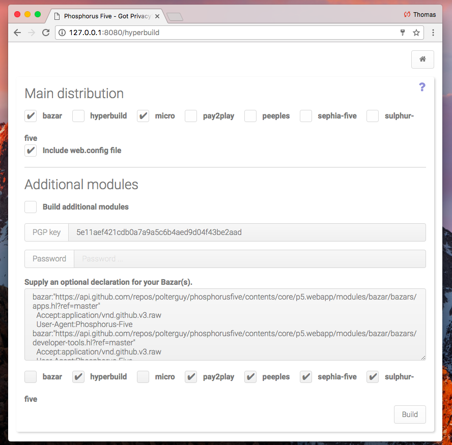

# Hyperbuild, Phosphorus Five's build system

This is the build system for [Phosphorus Five](https://github.com/polterguy/phosphorusfive), which allows you to 
reproduce your Phosphorus Five installation, any ways you see fit, and create a binary release of the system. 
This is done by taking the existing system's state, whatever that is, minus any data, users, passwords, settings, etc -
And create a binary release of the system, allowing you to cryptographically sign modules, choose
which modules are to be in the main distribution, etc.



If you have created your own modules, or changed existing modules, Hyperbuild will allow you to create
a binary release of your system, according to whatever changes you have applied to your original system.

**Notice** - When you run Hyperbuild, it will copy your DLLs from your "bin" folder, as they are in its current version.
This implies that you'd probably want to make sure you are running the system in its _"Release"_ build, if you are
creating your own build, from a source version of Phosphorus Five.

## Usage

Hyperbuild has a lot of settings, which allows you to build more or less P5 exactly as you see fit. Below you can find
the instructions on how to use it.

### Main distribution

This is your most important settings, and declares how you want your main installation to be like.

First you must choose which modules you want to include in your main distribution zip file. By default, the modules
selected for you are only the _"bazar"_ and _"micro"_. _"micro"_ is normally crucial, since most P5 modules depends
upon Micro being installed to function correctly. However, if you don't want to feature your own Bazar, you can
remove the _"bazar"_ module from your main distribution. If you don't include the Bazar in your main configuration,
you will have a _"static"_ system, without any Bazar integration - Which is probably quite useful, if all you want to
do is to create and distribute your own apps, and/or any of the integrated apps, as a stand alone web application/operating system.

Whichever other modules you include, will be included by default, in your own distribution, in your main .zip file, 
for your own Phosphorus Five distribution. The system works by traversing all folders inside of your _"p5.webapp/modules/"_
folder, implying that any custom modules you have created yourself, will be possible to include in your main distribution here.

It is definitely much easier to build a _"static"_ system, than it is to create a fully fledged Bazar system, with your own
Bazar implementation. For most users, this would probably suffice, and you can simply ignore everything below here.

**WARNING** - By default, the build process will include your _"web.config"_ file. If you have passwords, or other types of sensitive
data in this file, you should probably **not include your web.config** file in your main release build. How you want to distribute
an actual working web.config file if you ommit this file, is up to you to solve yourself.

However, the default web.config file, should not in general contain any sensitive data, since it relies upon MySQL installed, with
an empty root password, and no network drivers installed. In general, this shouldn't be a problem, unless you've got some customisations
of your system, which is outside of the scope of Hyperbuild.

### Additional modules

This is normally only relevant if you wish to create your own Bazar implementation - At which point, you'd normally have to 
cryptographically sign your additional modules, with your own private PGP key. This is a security feature in the Bazar, eliminating having
your users downloading and installing malicious code - Due to the only code that is allowed to be installed through the Bazar, are
programs that have been explicitly cryptographically signed by a trusted private PGP key.

The system will create one additional .zip file for each of these additional modules you choose to build. If you choose to cryptographically
sign these modules, which is done by choosing a private PGP key, **and supplying a password**, to have your private PGP key released from your 
GnuPG installation - These additional zip files will be cryptographically signed with your own private PGP key, and be 
named _"some-module.zip.pgp"_, allowing you to download these files after the build process has finished, and distribute them through your 
own Bazar.

### How the Bazar work

The Bazar is Phosphorus Five's _"AppStore"_, and allows you to securely distribute your own additional modules, either for a fee, or gratis -
And such allow consumers of your _"web operating system"_, to install additional modules, as they see fit.

The Bazar expects all of these additional modules to be cryptographically signed with your own private PGP key. This prevents an
adversary to inject malicious code into your user's systems, since by default the system will only trust modules, that have been cryptographically
signed, with a private PGP key, that must exist in the _"/modules/bazar/configuration/trusted-app-distributors.hl"_ file.

When you run Hyperbuild, it will create a new _"trusted-app-distributors.hl"_ file for you automatically, if you supply a private PGP key, and its
password to cryptographically sign any additional modules. This allows anything that has been cryptographically signed with the specified PGP key,
to be automatically installed, as an additional module, into your user's systems.

#### The Bazar(s) declaration file

This file defines where your Bazar(s) exists on the internet, and contains references to a Hyperlambda file on the internet, that the system
will automatically check (periodically), to see if there have been added new additional modules, that the user can download and install, on his
own system.

As you create your build, you will be asked to provide such a Bazar declaration file, which will be injected dynamically into your 
own _"/modules/bazar/configuration/bazars.hl"_ file, and such becomes a link to your actual Bazar implementations. Basically, this is a link, 
to one or more Hyperlambda file(s), on the internet, through which you want to inform users of your system, about new modules, and/or upgrades 
to existing modules.

Normally, this file should simply look like the following.

```
bazar:"https://my-server.com/my-bazar.hl"
```

As you update your _"Bazar content files"_, your users will automatically and dynamically, have the option to install new apps into their systems. The default Bazar
declaration file, contains additional HTTP headers, necessary to retrieve the default Phosphorus Five Bazar. You can add any amount of additional
static HTTP headers, as children to your **[bazar]** arguments, inside of your Bazar declaration file. However, by default, an *"If-Modified-Since"* 
header will be intelligently added, to avoid downloading Bazar content files, that have no new content. This is a feature to avoid downloading huge 
Bazar content files, that have not been changed, and hence will significantly speed up the traversal of your Bazar(s)' content files.

#### The Bazar content file(s)

